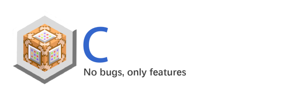

[![Contributors][contributors-shield]][contributors-url]
[![Forks][forks-shield]][forks-url]
[![Stargazers][stars-shield]][stars-url]
[![Issues][issues-shield]][issues-url]
[![GPL3 License][license-shield]][license-url]

<br/>
<div align="center" id="readme-top">



<h3 align="center">Cubecraft</h3>
  <p align="center">Your Game,Your Worlds,Your Stories.
    <br />
    <a href="https://github.com/othneildrew/Best-README-Template"><strong>Explore the docs »</strong></a>
    <br />
    <br />
    <a href="https://github.com/othneildrew/Best-README-Template">View Demo</a>
    ·
    <a href="https://github.com/othneildrew/Best-README-Template/issues">Report Bug</a>
    ·
    <a href="https://github.com/othneildrew/Best-README-Template/issues">Request Feature</a>
  </p>
</div>

## Content

<ol>
    <li>
        <a href="#about-the-project">About The Project</a>
        <ul>
            <li><a href="#introduction">Introduction</a></li>
            <li><a href="#built-with">Built With</a></li>
            <li><a href="#licence">Licence</a></li>
        </ul>
    </li>
    <li>
        <a href="#getting-started">Getting Started</a>
        <ul>
            <li><a href="#modify">Modify</a></li>
            <li><a href="#client-install">Client Install</a></li>
            <li><a href="#server-install">Server Install</a></li>
            <li><a href="#mod-dev">Mod Development</a></li>
        </ul>
    </li>
    <li><a href="#future-plan">Future Plan</a>
        <ul>
            <li><a href="#our-willing">Our Willing</a></li>
            <li><a href="#roadmap">RoadMap</a></li>
        </ul>
    </li>
    <li><a href="#future-plan">More Information</a>
        <ul>
            <li><a href="#special-thanks">Special Thanks</a></li>
            <li><a href="#contact">Contact</a></li>
            <li><a href="#contributing">Contributing</a></li>
        </ul>
    </li>
</ol>

<div id="about-the-project"></div>


<hr>


## About the project

<div id="introduction"></div>

### introduction

&nbsp;&nbsp;&nbsp;
Cubecraft is a simple Voxel Sandbox Game developed with java and lwjgl.
Different from the reducibility and gameplay of traditional works,
this game will pay more attention to framing and high scalability.
it serves as our technical platform.

&nbsp;&nbsp;&nbsp;
Due to our excessive rewriting of the world structure (such as 64-bit integers and other strange features),
cubecraft is temporarily unable to make any data compatibility with minecraft.
In the future, we may (as far as possible) implement data compatibility with minecraft.
(In addition, the architecture of cubecraft has been basically stable.
If anyone wants to write a data compatible mod, welcome.)


<div id="built-with"></div>

### Built With

these are the core technology that we used to uil the platform itself.

| Name        | Usage                                  | Link                                        |
|-------------|----------------------------------------|---------------------------------------------|
| Gson        | Model deserializing                    | https://github.com/google/gson              |
| FLua        | Scripting,Entity animation control     | https://github.com/ProtonGameStudio/FLua    |
| LWJGL3      | OpenGL binding,GLFW and Memory Control | https://github.com/LWJGL/lwjgl3             |
| FCommon     | Common tools,Registering               | https://github.com/ProtonGameStudio/FCommon |
| Quantum3D   | OpenGL packaging,Memory Control        | N/A                                         |
| SmartSocket | Network protocol implementation        | https://github.com/smartboot/smart-socket   |
| JRakNet     | Network protocol implementation        | https://github.com/whirvis/JRakNet          |
| NettyIO     | Network protocol implementation        | https://github.com/netty/netty              |
| JOML        | General math computing                 | https://github.com/JOML-CI/JOML             |

<div id="licence"></div>

### Licence

This project is under GPL-3 licence.
here are some of the licence.

```
                    GNU GENERAL PUBLIC LICENSE
                       Version 3, 29 June 2007

Copyright (C) 2007 Free Software Foundation, Inc. <https://fsf.org/>
Everyone is permitted to copy and distribute verbatim copies
of this license document, but changing it is not allowed. 

```

<p align="right">(<a href="#readme-top">back to top</a>)</p>


<hr/>


<div id="getting-started"></div>

## Getting Started

<div id="modify"></div>

#### Modify

1. Directly fork project
2. import the file into your IDE as a gradle project.
3. Make sure that the java version is 17 or above
4. Start modifying yourself

<div id="client-install"></div>

#### Client Install

1. Download the client jar file(coming soon)
2. put it anywhere (Notice: this folder will be automatically identified as the game
   folder)
3. Write a random cmd script, such as "java -jar"
4. Start the game, have fun

<div id="server-install"></div>

#### Server Install

1. Download the server jar file and
2. put it anywhere (note: this folder will be automatically identified as the game
   folder)
3. Write a random cmd script, such as java jar
4. Start the server. The default port is 11451

<div id="mod-dev"></div>

#### Mod development

1. Use the Module "Core","Client" and "server" as project references
2. start mod developing(the "Default" module could be an example)
3. See docs for more information(coming soon)

<!-- USAGE EXAMPLES -->

<p align="right">(<a href="#readme-top">back to top</a>)</p>

<hr/>

<div id="future plan"></div>

## Future Plan

<div id="our-willing"></div>

### Our Willing

- Making it runs in multiple render API
- having a fully data compatible with Minecraft
- having a network protcol compat with Minecraft

<div id="roadmap"></div>

### Roadmap

- [ ] Add network system
- [ ] Complete the mod API
- [ ] Add scripting System
- [ ] Complete Minecraft data compat layer
- [ ] Multi-language Support
    - [x] Chinese
    - [x] English
    - [ ] Japanese

See the [open issues](https://github.com/ProtonGameStudio/Cubecraft/issues) for a full list of proposed features (
and known issues).

<p align="right">(<a href="#readme-top">back to top</a>)</p>


<hr/>


<div id="more-info"></div>

## More Information

<div id="special-thanks"></div>

### Special thanks:

- MojangStudio and Microsoft did not sue me:).
- the makers of third-party java libraries.
- AdamYuan,Dreamtowards for giving me instructions on rendering.
- tuboshu，BDS： game test

<div id="contact"></div>

### Contact

- Grasslock2022: https://github.com/Grass-block
- FlyBird Games: https://github.com/ProtonGameStudio

<div id="contributing"></div>

### Contributing

Contributions are what make the open source community such an amazing place to learn, inspire, and create. Any
contributions you make are **greatly appreciated**.

If you have a suggestion that would make this better, please fork the repo and create a pull request. You can also
simply open an issue with the tag "enhancement".
Don't forget to give the project a star! Thanks again!

1. Fork the Project
2. Create your Feature Branch
3. Commit your Changes
4. Push to the Branch
5. Open a Pull Request
6. Waiting for the stupid GrassBlock2022 to merge it :D

<p align="right">(<a href="#readme-top">back to top</a>)</p>

<hr>

<h4 align="center">Cubecraft</h4>
<h6 align="center">artifact by GrassBlock2022, owned by FlybirdGames</h6>

<h6 align="center">(The END)</h6>


[contributors-shield]: https://img.shields.io/github/contributors/ProtonGameStudio/Cubecraft.svg?style=for-the-badge
[contributors-url]: https://github.com/ProtonGameStudio/Cubecraft/graphs/contributors
[forks-shield]: https://img.shields.io/github/forks/ProtonGameStudio/Cubecraft.svg?style=for-the-badge
[forks-url]: https://github.com/ProtonGameStudio/Cubecraft/network/members
[stars-shield]: https://img.shields.io/github/stars/ProtonGameStudio/Cubecraft.svg?style=for-the-badge
[stars-url]: https://github.com/ProtonGameStudio/Cubecraft/stargazers
[issues-shield]: https://img.shields.io/github/issues/ProtonGameStudio/Cubecraft.svg?style=for-the-badge
[issues-url]: https://github.com/ProtonGameStudio/Cubecraft/issues
[license-shield]: https://img.shields.io/github/license/ProtonGameStudio/Cubecraft.svg?style=for-the-badge
[license-url]: https://github.com/ProtonGameStudio/Cubecraft/blob/master/LICENSE.txt

